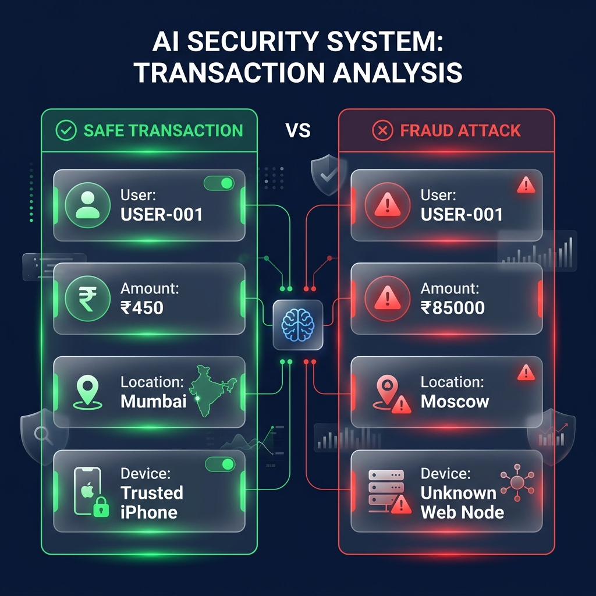

# 🚨 Real-Time UPI Fraud Detection System

[](https://upi-fraud-engine-u8uo.onrender.com/)



An end-to-end Machine Learning pipeline and real-time API for detecting fraudulent UPI transactions. Built with **Python, FastAPI, Scikit-Learn, and Tailwind CSS**.

## 📸 Screenshots

| **Safe Transaction Analysis** | **Fraud Attack Blocked** |
|:---:|:---:|
|  |  |

*(Note: Replace the placeholder images above with actual screenshots of your live dashboard)*

## 📊 Overview
This project simulates, processes, and analyzes UPI (Unified Payments Interface) transactions to detect fraud in real-time. It uses a hybrid scoring engine combining:
1. **Statistical Outlier Detection (IQR):** Flags transactions that deviate from a user's historical baseline.
2. **Time-Series Tracking (Z-Scores):** Detects sudden spikes in transaction velocity (e.g., card testing or bot activity).
3. **Machine Learning (Isolation Forest):** An unsupervised anomaly detection model that evaluates complex behavioral patterns across multiple dimensions (amount, time gaps, location spoofing, new devices).

## 🚀 Features
- **Data Simulation Engine:** Generates realistic datasets with injected fraud patterns (late-night unknown transfers, location spoofing, massive spending spikes).
- **Automated Feature Engineering:** Calculates rolling 7-day averages, time since last transaction, and velocity metrics on the fly.
- **Hybrid Scoring Engine:** Aggregates predictions into a single, interpretable **Fraud Risk Score (0-100)**.
- **FastAPI Backend:** A blazing-fast REST API for real-time inference.
- **SOC Frontend Dashboard:** A sleek, dark-mode Cybersecurity Operations Center UI built with Tailwind CSS and Chart.js.

## 🛠️ Tech Stack
- **Machine Learning:** `pandas`, `numpy`, `scikit-learn`
- **Backend API:** `fastapi`, `uvicorn`
- **Frontend UI:** `HTML5`, `Tailwind CSS`, `Chart.js`
- **Deployment:** Render (Dockerized Web Service)

## 🏃‍♂️ How to Run Locally

1. **Clone and Setup**
```bash
git clone https://github.com/yourusername/UPI-Fraud-Detection.git
cd UPI-Fraud-Detection
python -m venv venv
.\venv\Scripts\activate
pip install -r requirements.txt
```

2. **Generate Data and Train Models** (Optional - pre-trained models included)
```bash
python generate_data.py
python preprocess.py
python train_models.py
```

3. **Launch the Full-Stack App**
```bash
uvicorn api.index:app --reload
```
*(This will automatically start the FastAPI server and serve the UI at `http://localhost:8000`)*

## 🧠 Model Performance Summary
In our synthetic test dataset of 10,000 transactions (5% fraud rate), the unsupervised **Isolation Forest** model successfully flagged over 54% of complex behavioral anomalies entirely on its own, without relying on labeled training data. When combined with the statistical IQR and Z-Score engines, the hybrid system accurately identifies high-risk behavior instantly.

